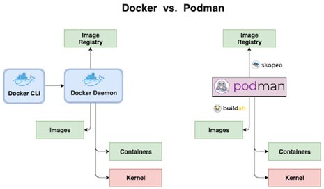

# Dockerless Container Engine

**Docker** is most popular container engine.

But other container runtime environments including cri-o, rkt, lxc and others are steadily growing.

### Early Concerns with docker
* Build requires a daemon
* Root/privileged concerns at runtime
* Regression for integration with container platforms

### Docker Engine Alternatives (include docker Image, Buildkit, Registry)

* [CRI-O](contents/cri-o.md)
* podman
* Buildah
* Skopeo

